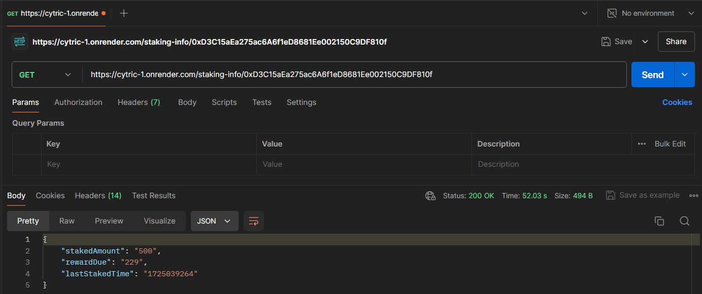
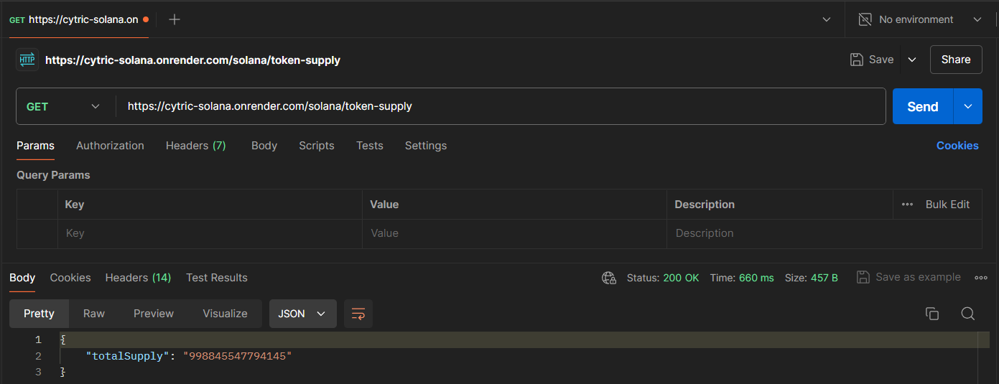
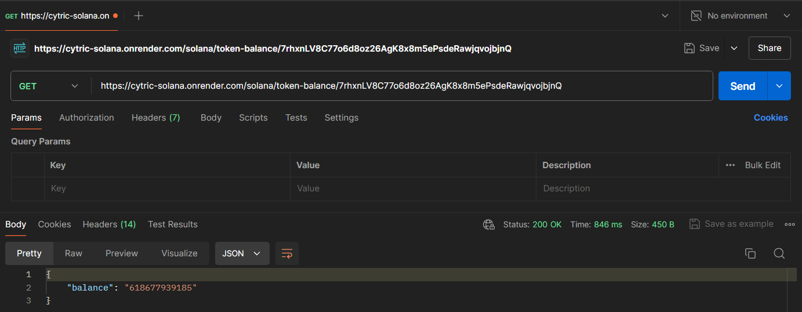

# Custom Staking Protocol & Solana API

This repository contains a custom staking smart contract, an Express.js API to interact with the contract, and an additional API to read data from the Solana blockchain. The project showcases the implementation of complex staking logic, dynamic reward adjustments, and cloud deployment.

## Table of Contents

1. [Project Overview](#project-overview)
2. [Features](#features)
3. [Tech Stack](#tech-stack)
4. [Task 1: Develop and Deploy a Custom Staking Smart Contract](#task-1-develop-and-deploy-a-custom-staking-smart-contract)
   - [Staking Mechanism](#staking-mechanism)
   - [Withdrawal Mechanism](#withdrawal-mechanism)
   - [Dynamic Reward Rate](#dynamic-reward-rate)F
   - [Reward Calculation](#reward-calculation)
5. [Task 2: API to Read from the Smart Contract](#task-2-api-to-read-from-the-smart-contract)
   - [Endpoints](#endpoints)
   - [API Usage](#api-usage)
6. [Task 3: API to Interact with a Solana Program (Read SPL Token Data)](#task-3-api-to-interact-with-a-solana-program-read-spl-token-data)
   - [Endpoints](#solana-api-endpoints)
   - [API Usage](#solana-api-usage)


## Live Links

- **Verified Contract:** [Staking Contract](https://sepolia.etherscan.io/address/0xc95Cc3F45E62f977C40ad4fD9259E9b775fB2A32#code)
- **Verified Contract:** [ERC20 Tokens](https://sepolia.etherscan.io/address/0x423DFf192F47949C741836b1E1E382D8bD33db3B#code)
- **Render Sepolia URL:** [Fetch Staking Info](https://cytric-1.onrender.com/staking-info/:address)
- **Render Solana Supply URL:** [Fetch Token Supply](https://cytric-solana.onrender.com/solana/token-supply)
- **Render Solana Balance URL:** [Fetch User Balance](https://cytric-solana.onrender.com/solana/token-balance/:address)


- **Code Explanation and Demo Video** [Video](https://drive.google.com/file/d/17kp7KOIUX46YwgJliIXYN_rObDNgUrWk/view?usp=sharing)


## Tech Stack

- TypeScript
- Solidity
- Hardhat
- OpenZeppelin
- Express.js
- Node.js
- Viem
- Solana Web3.js
- Render (for deployment)

## Task 1: Develop and Deploy a Custom Staking Smart Contract

- **Verified Contract:** [Staking Contract](https://sepolia.etherscan.io/address/0xc95Cc3F45E62f977C40ad4fD9259E9b775fB2A32#code)
- **Verified Contract:** [ERC20 Tokens](https://sepolia.etherscan.io/address/0x423DFf192F47949C741836b1E1E382D8bD33db3B#code)

### Staking Mechanism
- **Stake Tokens**: Users can stake ERC-20 tokens using the `stake(uint256 amount)` function. Tokens are transferred from the user's wallet to the contract, and the staking information is updated.

```solidity
function stake(uint256 amount) external {
        require(amount > 0, "Stake Amount Must be greater than 0");
        require(
            stakingToken.balanceOf(msg.sender) >= amount,
            "Account balance must be greater or equal than the Amount of Tokens to be Staked"
        );

        updateRewards(msg.sender);

        stakingToken.transferFrom(msg.sender, address(this), amount);

        StakerInfo storage staker = stakers[msg.sender];
        staker.stakedAmount += amount;
        staker.lastStakedTime = block.timestamp;

        totalStaked += amount;

        adjustRewardRate();

        emit Staked(msg.sender, amount);
    }
```
### Withdrawal Mechanism
- **Withdraw Tokens**: Users can withdraw their staked tokens and accumulated rewards using the withdraw(uint256 amount) function. The function ensures the contract has sufficient balance for the withdrawal and updates the user's staking information.

```solidity
function withdraw(uint256 amount) external {
        StakerInfo storage staker = stakers[msg.sender];

        updateRewards(msg.sender);

        uint256 rewards = staker.rewardDue;

        if (isSameToken) {
            uint256 totalWithdrawal = amount + rewards;
            require(
                stakingToken.balanceOf(address(this)) >= totalWithdrawal,
                "Insufficient contract balance for withdrawal"
            );
            stakingToken.transfer(msg.sender, totalWithdrawal);
        } else {
            require(
                stakingToken.balanceOf(address(this)) >= amount,
                "Insufficient contract balance for staked tokens withdrawal"
            );
            require(
                rewardToken.balanceOf(address(this)) >= rewards,
                "Insufficient reward balance for rewards withdrawal"
            );
            stakingToken.transfer(msg.sender, amount);
            rewardToken.transfer(msg.sender, rewards);
        }

        staker.stakedAmount -= amount;
        staker.rewardDue = 0;
        totalStaked -= amount;

        rewardPool -= int256(rewards);

        adjustRewardRate();

        emit Withdrawn(msg.sender, amount, rewards);
    }
```
### Dynamic Reward Rate
- **Dynamic Reward Rate**: The reward rate is dynamically adjusted based on the total amount staked. If the total staked amount is low, the reward rate increases, and if it’s high, the reward rate decreases.

```solidity
function adjustRewardRate() internal {
        if (totalStaked == 0 || rewardPool <= 0) {
            rewardRate = 0;
        } else {
            uint256 calculatedRate = 1e18 / totalStaked;
            uint256 maxRate = 1e18; 
            rewardRate = calculatedRate > maxRate ? maxRate : calculatedRate;
        }

        emit RewardRateAdjusted(rewardRate);
    }
```
### Reward Calculation
- **Dynamic Rewards**: Rewards are calculated based on the time tokens are staked. The longer the staking duration, the higher the rewards earned.

```solidity
function updateRewards(address _user) internal {
        StakerInfo storage staker = stakers[_user];

        if (staker.stakedAmount > 0) {
            uint256 stakingDuration = block.timestamp - staker.lastStakedTime;
            uint256 reward = (stakingDuration * rewardRate * staker.stakedAmount) / (rewardInterval * 1e18);

            staker.rewardDue += reward;
            staker.lastStakedTime = block.timestamp;
        }
    }
```

## Task 2: API to Read from the Smart Contract

This section of the project implements an Express.js API to interact directly with a staking smart contract on the Sepolia testnet. The API provides an endpoint to retrieve staking information for a given Ethereum address.

### Implementation Details

- The API is built using Node.js and Express.js.
- It uses the `viem` library to interact with the Ethereum blockchain.
- The connection to the Sepolia testnet is established using an RPC URL specified in the `SEPOLIA_RPC_URL` environment variable.
- The staking contract address and ABI are imported from a constants file.

### Endpoint

#### Get Staking Information

- **URL**: `/staking-info/:address`
- **Render URL**: `https://cytric-1.onrender.com/staking-info/:address`
- **Example URL**: `https://cytric-1.onrender.com/staking-info/0xD3C15aEa275ac6A6f1eD8681Ee002150C9DF810f`
- **Method**: GET
- **URL Params**: `address` (required) - The Ethereum address to check for staking information.
- **Description**: Returns the staking balance, accumulated rewards for the given address and the timestamp of the last staking action.
- **Response**: JSON object containing:
  - `stakedAmount`: The amount of tokens staked by the address.
  - `rewardDue`: The amount of rewards accumulated.
  - `lastStakedTime`: The timestamp of the last staking action.




### Error Handling

- If there's an error fetching the staking information, a 500 status code is returned with an error message.
- Any issues with client initialization or missing environment variables will throw an error during startup.


## Task 3: API to Interact with a Solana Program (Read SPL Token Data)

This section of the project implements an API to read data from an existing SPL token account on the Solana blockchain. The API provides endpoints to fetch the total supply of a specific SPL token and the token balance for a given wallet address.

### Implementation Details

- The API is built using Node.js and Express.

- It uses the `@solana/web3.js` library to interact with the Solana blockchain.

- The connection to the Solana network is established using the RPC URL specified in the `SOLANA_RPC_URL` environment variable. 

- The SPL token mint address is set through the `SPL_TOKEN_MINT_ADDRESS` environment variable. 

### Endpoints

#### 1. Get Token Supply

- **URL**: `/solana/token-supply`
- **Render URL**: `https://cytric-solana.onrender.com/solana/token-supply`

- **Method**: GET

- **Description**: Returns the total supply of the specified SPL token.

- **Response**: JSON object containing the `totalSupply` field.



#### 2. Get Token Balance for an Address

- **URL**: `/solana/token-balance/:address`
- **Render URL**: `https://cytric-solana.onrender.com/solana/token-balance/:address`
- **Example URL**: `https://cytric-solana.onrender.com/solana/token-balance/7rhxnLV8C77o6d8oz26AgK8x8m5ePsdeRawjqvojbjnQ`

- **Method**: GET

- **URL Params**: `address` (required) - The Solana public key of the wallet to check.

- **Description**: Returns the token balance of the specified address for the SPL token.

- **Response**: JSON object containing the `balance` field.



### Error Handling

- Both endpoints include error handling for failed requests.

- If an error occurs, a 500 status code is returned with an error message.

- For the token balance endpoint, a 404 status is returned if no token account is found for the given address.

